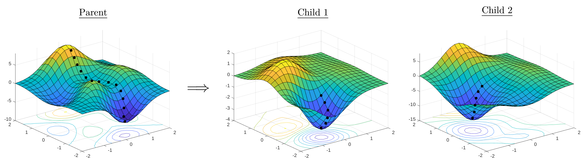
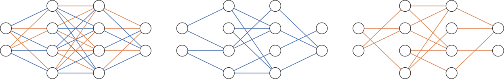

# Prune and Tune Ensembles

This repository is the official implementation of [Prune and Tune Ensembles](#). This codebase is still in progress of being cleaned up for eventual open source release.



<!--  -->

## Requirements

To install requirements:

```setup
pip install -r requirements.txt
```

## Training

Train the parent network, create the ensemble and tune the ensemble members.

```train
python train.py --checkpoint_dir=<DIR> \
                --dataset=<DATASET> \
                --data_path=<DATA_PATH> \
                --batch_size=<BATCH_SIZE> \
                --num_workers=<num_workers> \
                --model=<MODEL> \
                --parent_epochs=<PARENT_EPOCHS> \
                --save_freq=<SAVE_FREQ> \
                --optimizer=<OPTIMIZER> \
                --lr=<LR> \
                --momentum=<M> \
                --wd=<WD> \
                --num_children=<NUM> \
                --pruning_method=<METHOD> \
                --pruning_structure=<STRUCTURE> \
                --sparsity=<SPARSITY> \
                --child_epochs=<CHILD_EPOCHS> \
                --child_optimizer=<OPTIMIZER> \
                --child_lr=<LR> \
                --child_momentum=<M> \
                --child_wd=<WD> \
                --tuning_schedule=<SCHED> \
                --verbose=<V> \
                --seed=<SEED> \
```

Parameters:

- `checkpoint_dir` &mdash; where to save the trained model files (default: checkpoints/)
- `dataset` &mdash; name of the dataset to use [cifar10/cifar100] (default: cifar10)
- `data_path` &mdash; where to download the datasets (default: data/)
- `batch_size` &mdash; batch size for both the training and test loaders (default: 128)
- `num_workers` &mdash; number of workers to use for the data loaders (default: 4)
- `model` &mdash; name of the model architecture (default: None)
  - resnet18
  - densenet121
  - wideresnet28x10
- `parent_epochs` &mdash; number of epochs to train the parent (default: 140)
- `save_freq` &mdash; save the parent every n epochs during training (default: 10)
- `optimizer` &mdash; optimizer to use for training the parent network [sgd/~~adam~~] (default: sgd)
- `lr` &mdash; initial learning rate (default: 0.1)
- `momentum` &mdash; (default: 0.9)
- `wd` &mdash; (default: 5e-4)
- `num_children` &mdash; (default: 6)
- `pruning_method` &mdash; [antirandom/random] (default: antirandom)
- `pruning_structure` &mdash; [connections/neurons] (default: connections)
- `sparsity` &mdash; (default: 0.5)
- `child_epochs` &mdash; (default: 10)
- `child_optimizer` &mdash; [sgd/~~adam~~] (default: sgd)
- `child_lr` &mdash; (default: 0.1)
- `child_momentum` &mdash; (default: 0.9)
- `child_wd` &mdash; (default: 5e-4)
- `tuning_schedule` &mdash; [onecycle/fixed] (default: onecycle)
- `verbose` &mdash; [0/1] (default: 1)
- `seed` &mdash; (default: 1)

### A Note on Parent Network Training

This repository is still being updated. As such, only SGD is implemented now with the learning rate schedule detailed in the paper [Loss Surfaces, Mode Connectivity, and Fast Ensembling of DNNs](https://arxiv.org/abs/1802.10026).

```python
def learning_rate_schedule(base_lr, epoch, total_epochs):
    alpha = epoch / total_epochs
    if alpha <= 0.5:
        factor = 1.0
    elif alpha <= 0.9:
        factor = 1.0 - (alpha - 0.5) / 0.4 * 0.99
    else:
        factor = 0.01
    return factor * base_lr
```

## Evaluation

Uses the checkpoints saved from the training process. Each model is evaluated and logs their predictions to a file in predictions_dir. The ensemble is then evaluated on the test set.

> Important Note: The evaluations use all model files in the "checkpoints" folder that start with "model_name".

```evaluate
python evaluate.py --predictions_dir=<PRED_DIR> \
                   --checkpoint_dir=<DIR> \
                   --dataset=<DATASET> \
                   --data_path=<DATA_PATH> \
<<<<<<< HEAD
                   --corrupted=<True|False>
=======
>>>>>>> 8d7ab12caf393fc44a94e427c450b2ee6150a206
                   --batch_size=<BATCH_SIZE> \
                   --num_workers=<num_workers> \
                   --model=<MODEL> \
                   --verbose=<V> \
                   --seed=<SEED> \
```

- `predictions_dir` &mdash; (default: predictions/)
- `checkpoint_dir` &mdash; (default: checkpoints/)
- `dataset` &mdash; [cifar10/cifar100] (default: cifar10)
- `data_path` &mdash; (default: data/)
<<<<<<< HEAD
- `corrupted` &mdash; [True/False] (default: False)
=======
>>>>>>> 8d7ab12caf393fc44a94e427c450b2ee6150a206
- `batch_size` &mdash; (default: 100)
- `num_workers` &mdash; (default: 4)
- `model` &mdash; (default: None)
  - resnet18
  - densenet121
  - wideresnet28x10
- `verbose` &mdash; [0/1] (default: 1)
- `seed` &mdash; (default: 1)

## Results

The defaults are set up to reproduce the "large training budget experiment" from the paper.

That is, parent is trained for 140 epochs. 6 children are created using antirandom pruning that are each tuned for 10 epochs using the one-cycle schedule.

```reproduce
<<<<<<< HEAD
python3 train.py --model wideresnet28x10 --dataset cifar10
python3 evaluate.py --model wideresnet28x10 --dataset cifar10
```

```reproduce
python3 train.py --model wideresnet28x10 --dataset cifar100
python3 evaluate.py --model wideresnet28x10 --dataset cifar100
=======
python train.py --model wideresnet28x10 --dataset cifar10
```

```reproduce
python train.py --model wideresnet28x10 --dataset cifar100
>>>>>>> 8d7ab12caf393fc44a94e427c450b2ee6150a206
```

| Model name             | CIFAR-10 Accuracy | CIFAR-100 Accuracy |
| ---------------------- | ----------------- | ------------------ |
| WRN28x10 PAT (AR + 1C) | 96.45%            | 82.44%             |

<<<<<<< HEAD
To test on the out-of-distribution corrupted variants, you need to download the corrupted datasets from https://zenodo.org/record/2535967 and https://zenodo.org/record/3555552. The corrupted github repo is https://github.com/hendrycks/robustness.

Put them in the data folder so we have `data/CIFAR-10-C/` and `data/CIFAR-100-C/`.

Then evaluate by passing the corrupted argument as True.

```reproduce
python3 evaluate.py --model wideresnet28x10 --dataset cifar10 --corrupted True
python3 evaluate.py --model wideresnet28x10 --dataset cifar100 --corrupted True
```

=======
>>>>>>> 8d7ab12caf393fc44a94e427c450b2ee6150a206
## Contributing

Our codebase is open source and licensed under the MIT License. This current repo is in progress of being updated. Feel free to reach out with questions or improvements.
